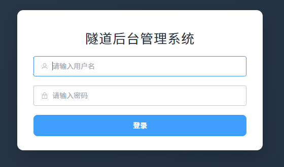
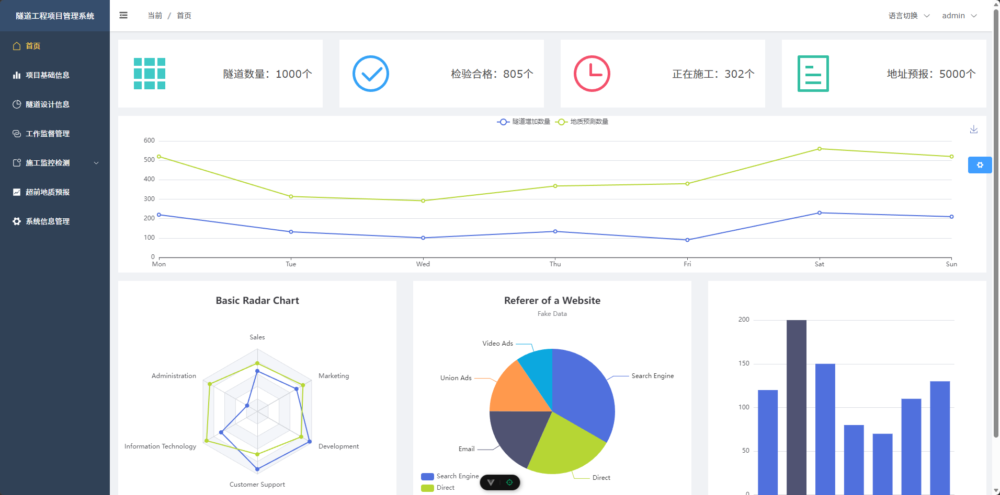
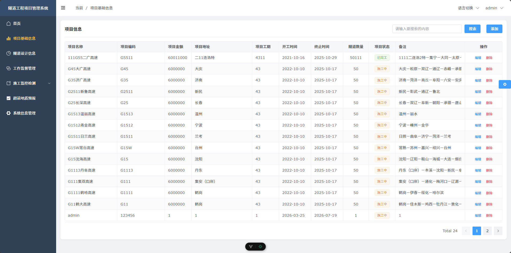
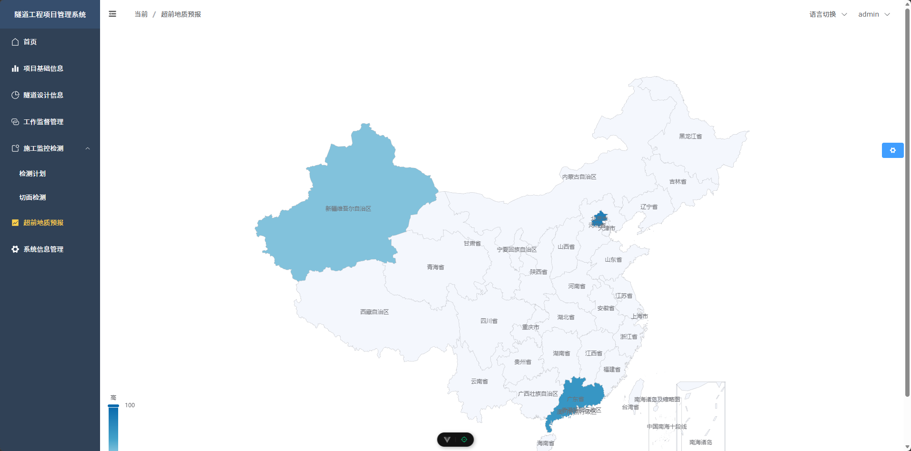
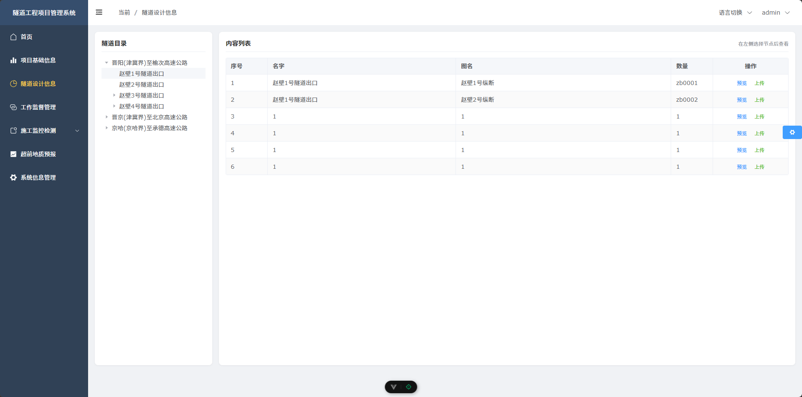
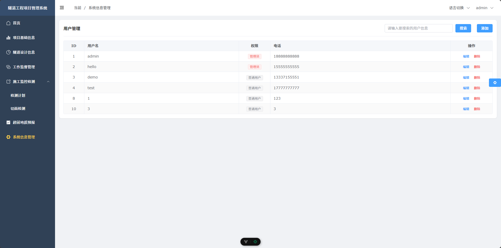

# vue3-management

本系统原型借鉴山西省铁路隧道工程管理类外包项目的常见交付形态：在隧道建设过程中，业主/总包方需要把项目基础信息、隧道设计资料（多级目录与附件/PDF）、地质资料、施工与计划类管理数据集中到一个后台里，支撑不同角色在同一套界面下完成查询、维护与审批协作的前置能力。项目目的是用可运行的中后台系统还原该类业务的“资料分层—权限分流—数据可检索可维护”核心链路：先通过登录与角色返回动态菜单，再在各业务模块中按列表/详情/编辑流程管理结构化数据，并把富文本说明、图表统计与文件上传等能力嵌到日常管理动作里，体现隧道工程项目管理后台以资料与数据为中心、以角色为边界的运转方式

## 项目简介

本项目采用前后端分离架构：

- 前端：`Vue 3 + Vite + Element Plus + Pinia + Vue Router`
- 后端：`Express + MySQL + JWT + Multer`
- 前端开发环境通过 Vite 代理将 `/api` 请求转发到后端 `3000` 端口

项目内实现了登录鉴权、动态菜单、项目管理、隧道信息、用户管理、文件上传、图表展示等常见后台能力。

## 功能模块

- 登录与权限控制（JWT）
- 动态路由与菜单（按用户角色返回菜单数据）
- 项目信息管理（查询、分页、增删改）
- 隧道信息管理（层级列表、详情、PDF 预览）
- 用户管理（查询、搜索、增删改）
- 富文本编辑（TinyMCE）
- 图表展示（ECharts）
- 国际化支持（Vue I18n）

## 技术栈

### 前端

- Vue 3
- Vite
- Vue Router
- Pinia（含持久化插件）
- Element Plus + 自动导入
- Axios
- ECharts
- TinyMCE

### 后端

- Express
- MySQL（`mysql` 驱动）
- JSON Web Token
- Multer（文件上传）
- CORS / body-parser

## 目录结构

```text
vue3-management/
├─ docs/
│  └─ screenshots/           # README 项目截图目录
├─ src/                      # 前端源码
│  ├─ api/                   # 接口地址与请求封装
│  ├─ components/            # 通用组件
│  ├─ router/                # 静态/动态路由
│  ├─ stores/                # Pinia 状态管理
│  ├─ utils/                 # 工具与请求实例
│  └─ views/                 # 页面模块
├─ server/                   # 后端服务
│  ├─ data/                  # 静态菜单/图表测试数据
│  ├─ index.js               # 后端启动入口（默认 3000 端口）
│  ├─ router.js              # API 路由
│  └─ SQLConnect.js          # MySQL 连接池配置
├─ upload/                   # 上传文件目录（运行时自动创建）
├─ vite.config.js            # Vite 配置（含 /api 代理）
└─ package.json
```

## 环境要求

- Node.js：`^20.19.0 || >=22.12.0`（见 `package.json`）
- npm：建议使用与 Node 对应的较新版本
- MySQL：建议 5.7+ 或 8.x

## 本地运行（完整步骤）

### 1. 安装依赖

```bash
npm install
```

### 2. 准备数据库

1. 在本地 MySQL 中创建数据库：

```sql
CREATE DATABASE vue3_management DEFAULT CHARSET utf8mb4;
```

2. 导入项目所需表结构与初始数据（如果你有 SQL 文件，直接导入即可）。
3. 检查数据库连接配置（`server/SQLConnect.js`）：

- `host`: `localhost`
- `user`: `root`
- `password`: 你的数据库密码
- `database`: `vue3_management`

> 注意：当前代码默认 `password` 为空字符串，请按你的本机环境修改。

### 3. 启动后端服务

```bash
node server/index.js
```

默认监听地址：`http://localhost:3000`

### 4. 启动前端开发服务

```bash
npm run dev
```

默认访问地址一般是：`http://localhost:5173`

前端会将 `/api` 请求代理到 `http://localhost:3000`。

## 构建与预览

### 生产构建

```bash
npm run build
```

### 本地预览构建结果

```bash
npm run preview
```

## 接口与代理说明

- 开发环境下，前端请求基址优先读取 `VITE_API_BASE`
- 若未设置，开发时默认走 `/api`（由 Vite 代理）
- 生产环境默认回退到 `http://localhost:3000/api`

如需切换后端地址，可在启动前设置环境变量：

```bash
VITE_API_BASE=http://your-server:3000/api
```

Windows PowerShell 示例：

```powershell
$env:VITE_API_BASE="http://127.0.0.1:3000/api"
npm run dev
```

## 常用命令

```bash
# 安装依赖
npm install

# 启动前端开发服务
npm run dev

# 启动后端服务
node server/index.js

# 打包前端
npm run build

# 预览打包结果
npm run preview
```

## 常见问题

### 1) 前端启动了但接口报错 / 404

- 确认后端是否已启动：`node server/index.js`
- 确认后端端口为 `3000`
- 确认数据库连接配置正确且数据库已创建

### 2) 数据库连接失败

- 检查 `server/SQLConnect.js` 中账号密码是否正确
- 检查 MySQL 服务是否已启动
- 检查数据库名是否为 `vue3_management`

### 3) 文件上传失败

- 确认项目根目录有 `upload` 目录（无则运行后自动创建）
- 确认当前用户对项目目录有写入权限

## 项目截图

截图目录：`docs/screenshots/`

<table>
  <tr>
    <td align="center"><b>登录页</b></td>
    <td align="center"><b>首页</b></td>
  </tr>
  <tr>
    <td></td>
    <td></td>
  </tr>
  <tr>
    <td align="center"><b>项目信息</b></td>
    <td align="center"><b>地质信息</b></td>
  </tr>
  <tr>
    <td></td>
    <td></td>
  </tr>
  <tr>
    <td align="center"><b>隧道信息</b></td>
    <td align="center"><b>系统管理</b></td>
  </tr>
  <tr>
    <td></td>
    <td></td>
  </tr>
</table>

## License

仅用于学习与交流，欢迎 Star 与 Fork。